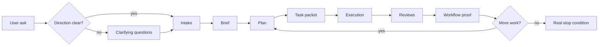

# 🧠 devgod

<p align="center">
  <strong>manager-led workflow control layer, shared runtime, and proof system for Codex-based software work</strong>
</p>

<p align="center">
  
  
  
  
  
  
</p>

> `devgod` is an installable package that adds a reusable control layer, runtime-backed workflow state, operator tooling, and proof-oriented completion checks to Codex-driven repository work.
>
> It tries to make Codex behave less like a loose chat session and more like a small engineering org with scope, memory, review gates, and receipts.

```text
user ask
   ↓
clarify direction when needed
   ↓
intake → brief → plan → task packet → execution → reviews → workflow proof
   ↓
next task or real stop condition
```

## ✨ At A Glance

`opt-in overlay` `production-oriented package checks` `runtime-backed authority` `review gates` `autonomous continuation` `codex automation adapters` `MCP server` `operator UI` `docs export`

For new substantive asks, DevGod now prefers a short clarification pass before planning or implementation. The default target is up to four questions covering intended outcome, primary user or operator, constraints or non-goals, and concrete done criteria. If the request is already clear enough, DevGod records explicit operating assumptions instead of asking unnecessary questions.

## 📦 What It Is Right Now

As of `2026-06-13`, this repo is the package source of truth for DevGod and has green package/install proof plus runtime workflow closeout proof for the repaired core overlay.

The current package ships:

- a repo installer and upgrade overlay for consuming repositories
- reusable `AGENTS.md`, `.codex/agents/`, `.agents/skills/`, `.devgod/rules/`, and `.devgod/templates/`
- a TypeScript CLI and runtime service for task state, reviews, approvals, checkpoints, reports, and workflow proof
- autonomous execution surfaces including `status`, `coverage`, `gaps`, `checkpoint`, `resume`, `daemon`, `supervisor`, `supervisor-history`, `recover`, and `plan-context`
- Codex-native deferred-work handoffs for app automations and CLI scheduler flows
- installed-repo verification harnesses and a supported `seed-modernization-proof` path
- an MCP server and lightweight operator UI

> This repo proves the package behavior and the focused installed-repo harness path.
> It does not prove that every consuming repo is fully operational after install.

Installed repos still need their own runtime registration, review identity wiring, and repo-local evidence.

## 🚦 Release Snapshot

Fresh package/install and runtime workflow evidence for the June 12 repair roadmap is green:

- `node --experimental-strip-types --test tests/install.test.ts tests/happy-path.test.ts` passed `120/120`
- `bash scripts/verify-installed-repo-harness.sh` passed
- `npm run check:happy-path` passed
- `npm run check:quality` passed
- `git diff --check` passed
- no `.only` tests were left in the maintainer verification surface
- runtime proof run `d5a2b9ac-aa2d-4412-8387-578f0b849102` approved `2026-06-12-devgod-autonomous-team-repair`
- `npm run devgod -- status --format text` reports `integrity.status` as `consistent`
- `bash scripts/check-devgod-workflow.sh --task-id 2026-06-12-devgod-autonomous-team-repair` passed
- `bash scripts/check-devgod-workflow-live.sh --repo-root . --task-id 2026-06-12-devgod-autonomous-team-repair` passed

That means the current proof here covers the package, the install overlay, the focused installed-repo harness, and the June 12 repair task workflow closeout in this checkout. It does not prove that every consuming repo is fully operational after install.

## 🎯 Mission

Devgod is trying to make AI coding work less hand-wavy.

It pushes a session away from:

- "the model said it was done"

and toward:

- explicit scope
- tracked artifacts
- review gates
- verification evidence
- persisted runtime state
- clear next actions when work is not actually complete

The big idea is simple: autonomy is only useful if it is inspectable, resumable, and skeptical of its own claims.

## 🗺️ Workflow Map



## 🏠 Where DevGod Lives

| Place | What it is | What it owns |
| --- | --- | --- |
| `this repo` | the package source of truth | reusable runtime, installer, MCP/UI, rules, templates, skills, agent profiles |
| `a consuming repo` | where real project work happens after install | `.env.devgod`, `.devgod/work/`, runtime registration, authenticated reviews, project-specific overlays |

Short version:

- this repo owns reusable package assets under `src/`, `scripts/`, `.agents/`, `.codex/`, `.devgod/templates/`, and `plugins/`
- consuming repos own their own local workflow state and runtime setup

Keep that boundary straight. Package verification here is evidence about the package. It is not blanket proof for target repos.

## 🧱 Shipped Surfaces

### 🛠️ Install and upgrade overlay

Shipped through:

- `src/install/cli.ts`
- `src/install/merge.ts`
- `scripts/install-devgod.sh`
- `scripts/setup-devgod.sh`

This layer installs or upgrades the managed DevGod overlay without flattening unrelated repo config.
For managed `.codex/config.toml` merges, the preservation contract is semantic config: unrelated user-owned TOML values stay intact, but formatting and comments can be rewritten when a managed update changes the merged file.

### 🏦 Runtime and authority layer

Shipped through:

- `src/admin.ts`
- `src/core/service.ts`
- `src/store/postgres-store.ts`
- `src/sql/migrations/`

This layer tracks projects, runs, tasks, reviews, approvals, checkpoints, retrieval work, and runtime authority.

### 🤖 Automation-aware continuation

Shipped through:

- `src/admin.ts`
- `src/admin/autonomous-summary.ts`
- `src/admin/status.ts`
- `src/admin/ops.ts`
- `plugins/devgod/scripts/hook-policy.mjs`

Current deferred-work behavior now distinguishes between immediate continuation and delayed follow-up:

- `defer_same_thread` can materialize a Codex app thread automation or a same-thread CLI resume handoff
- `defer_fresh_run` can materialize a Codex app standalone automation or a fresh-run CLI scheduler handoff
- unsupported automation cases fall back to explicit operator handoff instead of fake continuation prose

### 🧭 Operator and inspection layer

Shipped through:

- `src/admin/devgod.ts`
- `src/admin/status.ts`
- `src/admin/ops.ts`
- `src/admin/report.ts`
- `src/mcp/server.ts`
- `src/ui/server.ts`

This is how operators and tools inspect what the runtime currently considers true.

### 🗃️ Knowledge and export layer

Shipped through:

- `src/runtime/repo-markdown-indexer.ts`
- `src/docs-export/`
- `src/store/postgres-memory-search.ts`

This layer supports retrieval refresh, markdown indexing, lexical-first artifact search, pgvector semantic fallback, and Obsidian-oriented export.

Devgod retrieval is opinionated: exact terms and explicit operator vocabulary should carry the primary lookup path, while pgvector remains an always-on fallback when lexical recall misses relevant context.
In short: lexical-first retrieval with pgvector semantic fallback.

## 🚀 Quick Start

### If you are working on `devgod` itself

Requirements:

- Node.js `>=22`
- `npm`
- Docker if you want the default local runtime path

Useful source-repo commands:

```bash
npm run devgod -- help
npm run setup:local
npm run doctor
npm run status
npm run ops
npm run devgod:focus
npm run devgod:refresh-retrieval:fast
```

### If you want to install `devgod` into another repo

From this source repo:

```bash
npm run install:project -- init --apply --target /absolute/path/to/project
```

To add optional module wiring during install:

```bash
npm run install:project -- init --apply --target /absolute/path/to/project --with-graphify
npm run install:project -- init --apply --target /absolute/path/to/project --with-playwright
npm run install:project -- init --apply --target /absolute/path/to/project --with-grafana
```

Then inside the target repo:

```bash
npm install
npm run devgod:setup:git-guard
npm run devgod:verify:git-guard
npm run devgod:setup:local
npm run devgod:doctor
npm run devgod:verify:setup
```

Only when the corresponding optional module was installed:

```bash
npm run devgod:setup:graphify
npm run devgod:graphify:codex-full
npm run devgod:setup:playwright
npm run devgod:verify:playwright
```

Important:

- installed repos get the `devgod:*` script names
- installed repos default to the core script surface only; Graphify and Playwright repo wiring are opt-in
- this source repo uses shorter package-maintainer names like `setup:local`, `doctor`, and `status`
- `--with-graphify` adds Graphify MCP wiring plus repo-local Graphify setup scripts
- `--with-playwright` adds Playwright MCP profiles plus repo-local Playwright setup scripts
- `--with-grafana` adds Grafana MCP wiring only; it does not install Grafana
- UI-affecting tasks rely on Playwright only when the repo explicitly opts into the Playwright module during install

## 🧰 Command Surfaces

This repo intentionally ships two naming layers:

- the source repo keeps short maintainer names for package work
- installed repos get namespaced `devgod:*` operator scripts

### Core maintainer commands

These are the primary package-maintainer commands in this repo:

```bash
npm test
npm run typecheck
npm run check:quality
npm run install:project -- init --apply --target /absolute/path/to/project
npm run devgod -- help
npm run devgod -- workflow-proof --run-id latest --task-id <task-id>
```

Treat `npm run devgod -- ...` as the canonical maintainer entrypoint for admin flows such as `doctor`, `status`, `ops`, `report`, `coverage`, `gaps`, `checkpoint`, `resume`, `daemon`, and `supervisor`.

### Core installed commands

After installation, a consuming repo gets repo-local operator commands centered on:

```bash
npm run devgod:setup:local
npm run devgod:doctor
npm run devgod:verify:setup
npm run devgod:status
npm run devgod -- workflow-proof --run-id latest --task-id <task-id>
```

The repo-local package invocation is the canonical runtime contract for installed repos. The current `npm run devgod:check-workflow` shell wrapper remains as a legacy compatibility alias and migration note, not as the preferred operator surface.

### Optional module commands

These stay outside the core matrix and should be documented only when the module is enabled:

```bash
npm run mcp
npm run ui
npm run setup:playwright
npm run verify:playwright
npm run setup:graphify
npm run devgod:graphify:build
npm run devgod:graphify:codex-full
npm run devgod:graphify:serve
npm run devgod:graphify:update
npm run devgod:graphify:watch
npm run devgod:mcp
npm run devgod:ui
npm run devgod:setup:playwright
npm run devgod:verify:playwright
npm run devgod:setup:graphify
npm run devgod:grafana:mcp
```

Installed repos only get `devgod:setup:graphify` plus `devgod:graphify:*` when install uses `--with-graphify`.
Installed repos only get `devgod:setup:playwright` plus `devgod:verify:playwright` when install uses `--with-playwright`.
`devgod:grafana:mcp` only appears when installation opts into Grafana wiring with `--with-grafana`.

### Legacy aliases and migration notes

The repo still ships compatibility names. Do not remove them until tests cover the replacement path or the command can fail with a clear operator-facing message.

- source-repo maintainer shims such as `setup:local`, `doctor`, `status`, `verify:setup`, and `ops` stay available, but new docs should prefer `npm run install:project -- ...` or `npm run devgod -- ...`
- installed-repo aliases such as `devgod:heal` and `devgod:focus` stay available as compact wrappers over `doctor --repair` and `ops --format text`
- `devgod:check-workflow` stays as the compatibility shell wrapper while the runtime contract and current docs point at `npm run devgod -- workflow-proof --run-id latest --task-id <task-id>`

Installed repos still get a broader script set when the workflow needs it:

- `devgod:checkpoint`
- `devgod:resume`
- `devgod:advance-active-task`
- `devgod:reconcile`
- `devgod:sync-runtime-exports`
- `devgod:plan-context`
- `devgod:refresh-retrieval`
- `devgod:refresh-retrieval:fast`
- `devgod:autopilot-status`
- `devgod:github-dispatch`
- `devgod:mcp`
- `devgod:ui`
- `devgod:record-review`
- `devgod:scaffold-workflow`
- `devgod:upgrade-reasoning-workflow`
- `devgod:seed-happy-path-fixture`
- `devgod:check:happy-path`
- `devgod:check-workflow`
- `devgod:verify:migrations:live`

Planning and retrieval defaults are intentionally lighter now:

- `devgod:focus` is a compact alias over the deterministic `ops --format text` surface
- `devgod:refresh-retrieval:fast` refreshes markdown and artifact indexes first, then lets embeddings catch up separately
- `plan-context` reports stale derived state immediately unless you explicitly pass `--auto-refresh-repo-context` and/or `--auto-refresh-retrieval`

### Optional Grafana log access

When a consuming repo is installed with `--with-grafana`, DevGod adds a local Grafana MCP server entry and a `devgod:grafana:mcp` script. The MCP server reads connection settings from `.env.devgod`.

Required connection settings:

- `DEVGOD_GRAFANA_URL`
- `DEVGOD_GRAFANA_LOGS_DATASOURCE_UID`
- one auth mode: `DEVGOD_GRAFANA_TOKEN` or `DEVGOD_GRAFANA_USERNAME` plus `DEVGOD_GRAFANA_PASSWORD`

Optional settings:

- `DEVGOD_GRAFANA_ORG_ID`
- `DEVGOD_GRAFANA_LOKI_TENANT_ID`
- `DEVGOD_GRAFANA_TIMEOUT_MS`

Installed repos can validate the wiring with:

```bash
npm run devgod:grafana:mcp
```

Grafana logs are advisory evidence for debugging and research. They do not replace runtime workflow proof, authenticated reviews, or repo-local verification.

### Optional Module Follow-Ups

- Graphify remains opt-in and still needs repo-local setup plus freshness proof when a consuming repo enables it.
- Playwright remains opt-in and should only be treated as ready in a target repo after that repo installs the module and passes its own Playwright verification.
- Grafana wiring is optional, advisory, and separate from the core release gate; it should not be hidden under the core green package proof.

## 💡 Why It Feels Different

Devgod is opinionated about a few things:

- the root thread should act like an engineering manager, not a solo autocomplete
- substantive work should leave artifacts behind
- review gates should exist even when one human is driving the session
- runtime state should outrank chat confidence
- "continue until complete" should mean bounded repair loops and explicit blockers, not infinite retries

## 🚧 Current Boundaries

Important boundaries that still apply:

- consuming repos still need their own runtime setup, review identity backend, and authenticated workflow proof
- runtime rows remain the authority boundary over markdown exports
- the package can ship modernization-mode logic and proofs, but rewrite readiness in a target repo still depends on that repo's own evidence
- redesign docs describe the operating model and roadmap, not a guarantee that every installed repo already satisfies it

## 🛡️ Release Posture

Devgod still ships a careful `repo-local release posture`.

Use these `production-oriented package checks` as evidence about the package itself:

- `npm run verify:agent-caveman`
- `npm run verify:release-overlay`
- `npm run verify:migrations:live`

All shipped `.codex/agents/*.toml` subagents are expected to stay on caveman `ultra` mode for every emitted response, with `/caveman ultra` as the activation reference. Root manager intermediate progress updates, internal coordination, handoffs, and visible reasoning summaries also use caveman `ultra`; only final reports, direct questions, or ordinary user conversation use normal prose.

The package now ships caveman as a mandatory repo-local skill and Codex plugin surface in downstream installs; it is not an optional post-install add-on.

Maintainer-only quality tooling stays in this source repo and does not ship into consuming repos:

- `npm run test:properties`
- `npm run eval:promptfoo:maintainer-boundary`
- `npm run test:mutation:maintainer-boundary:dry-run`

Do not treat those checks alone as `any claim that a consuming repo is fit for production use`.
That still depends on the target repo, its runtime wiring, its review identity setup, and its own operational decisions.

## 📚 Docs Map

- [docs/current-state.md](docs/current-state.md): plain-language snapshot of what DevGod is today
- [docs/global-setup.md](docs/global-setup.md): source repo versus consuming repo setup notes
- [docs/large-repo-modernization-mode.md](docs/large-repo-modernization-mode.md): modernization-mode design and shipped rollout status
- [docs/autonomous-execution-redesign.md](docs/autonomous-execution-redesign.md): broader redesign contract and architecture direction
- [docs/codex-automation-surface-integration-plan.md](docs/codex-automation-surface-integration-plan.md): automation-provider design that informed the shipped integration
- [docs/devgod-goal-gap-audit.md](docs/devgod-goal-gap-audit.md): historical gap audit context
- [docs/benchmarks/orchestration-benchmark.md](docs/benchmarks/orchestration-benchmark.md): orchestration benchmark notes
- [docs/maintainers/quality-tooling.md](docs/maintainers/quality-tooling.md): maintainer-only regression tooling boundaries

## 🗂️ Repo Layout

```text
src/         runtime, installer, MCP, UI, exports, store
scripts/     setup, install, verification, workflow checks
.agents/     devgod skills
.codex/      devgod agent profiles and config
.devgod/     rules, templates, memory docs, package-maintainer workflow state
docs/        current state, setup notes, redesign, modernization, benchmarks
tests/       package verification and regression coverage
plugins/     packaged hook/plugin surfaces
```

## 🧪 Honest Pitch

Devgod is trying to turn:

`AI coding assistant`

into:

`small engineering org with runtime state, process, and receipts`

Right now the honest description is:

- reusable package
- workflow controller
- runtime-backed evidence system
- Codex overlay for repository work

Not magic. Just stricter operating rules and better proof for model-driven work.
