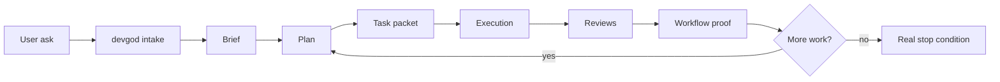

# 🧠 devgod

<p align="center">
  <strong>tiny engineering manager • runtime-backed workflow brain • receipts included</strong>
</p>

<p align="center">
  
  
  
  
  
</p>

> `devgod` is an installable control layer and shared runtime for AI-assisted software work.
> It tries to make Codex behave less like a loose chat session and more like a tiny engineering org with memory, workflow, review gates, and proof.

```text
you ask
   ↓
devgod intakes
   ↓
brief → plan → task → reviews → proof → next task
```

## ✨ What It Is

As of `2026-05-20`, this repo is the source-of-truth package for a manager-led workflow system that can be installed into other repositories.
The package-level remediation described in the redesign docs is now shipped in this repo and runtime-proven at the package level.

### 🏷️ Fast tags

`Codex overlay` `shared runtime` `workflow controller` `review gates` `proof-first` `continuation loop` `MCP server` `docs export`

### 📦 It ships today

- install and upgrade overlay for Codex-managed repos
- reusable `AGENTS.md`, `.codex/agents/`, `.agents/skills/`, `.devgod/rules/`, and `.devgod/templates/`
- TypeScript CLI for status, ops, recovery, workflow proof, review recording, and docs export
- Postgres-backed workflow/runtime store for runs, tasks, reviews, approvals, memory, and checkpoints
- retrieval helpers plus Qdrant vector storage support
- daemon, supervisor, and loop surfaces for continuing autonomous work
- MCP server and hosted operator UI
- Obsidian-oriented docs export

This package is still an `opt-in overlay` with `production-oriented package checks`, not a blanket production certification for every consuming repo.

## 🎯 Mission

Devgod's mission is to make AI coding work less hand-wavy.

It pushes a session away from:

- "the model said it was done"

and toward:

- explicit scope
- tracked artifacts
- review gates
- verification evidence
- persisted runtime state
- clear next actions when work is not actually complete

The big idea is simple: autonomy is only useful if it is inspectable, resumable, and skeptical of its own claims.

## 🗺️ Mental Model



## 🏠 The Two Places Devgod Lives

| Place | What it is | What it owns |
| --- | --- | --- |
| `this repo` | the package source of truth | reusable runtime, installer, skills, agent profiles, rules, templates |
| `a consuming repo` | where real project work happens after install | repo-specific `.devgod/work/`, `.env.devgod`, runtime registration, review identity wiring, local overlays |

Short version:

- this repo owns reusable package assets under `src/`, `scripts/`, `.agents/`, `.codex/`, and `.devgod/templates/`
- consuming repos own their own local workflow state and runtime setup

## 🧱 Current Shape

### 🛠️ Install layer

- `src/install/cli.ts`
- `src/install/merge.ts`
- `scripts/install-devgod.sh`
- `scripts/setup-devgod.sh`

This layer installs or upgrades devgod inside another repo and merges managed assets without flattening unrelated local config.

### 🏦 Runtime and authority layer

- `src/admin.ts`
- `src/core/service.ts`
- `src/store/postgres-store.ts`
- `src/runtime/`
- `src/sql/migrations/`

This is the real engine. It stores projects, runs, tasks, reviews, approvals, memory, checkpoints, and runtime registrations.

### 📋 Workflow layer

- `.devgod/templates/`
- `.devgod/rules/`
- `.agents/skills/devgod-*`
- `.codex/agents/*.toml`

This is the control layer that tells Codex how to intake work, plan it, execute it, review it, and stop bluffing about completion.

### 🧭 Operator layer

- `src/admin/status.ts`
- `src/admin/ops.ts`
- `src/admin/report.ts`
- `src/admin/devgod.ts`
- `src/ui/server.ts`
- `src/mcp/server.ts`

This is how humans and tools inspect what the runtime thinks is true.

### 🗃️ Knowledge and export layer

- `src/runtime/repo-markdown-indexer.ts`
- `src/docs-export/`
- `src/store/qdrant-artifact-index.ts`

This handles retrieval refresh, markdown indexing, and turning work into Obsidian-friendly notes.

## 🚀 Quick Start

### If you are working on `devgod` itself

Requirements:

- Node.js `>=22`
- `npm`
- Docker if you want the default local runtime path

Useful source-repo commands:

```bash
npm run devgod -- help
npm run install:project -- init --apply --target /absolute/path/to/project
npm run setup:local
npm run doctor
npm run status
npm run ops
npm run devgod -- report --run-id latest
npm run devgod -- coverage --run-id latest --format text
npm run devgod -- gaps --run-id latest --format text
```

### If you want to install `devgod` into another repo

From this source repo:

```bash
npm run install:project -- init --apply --target /absolute/path/to/project
```

Then inside the target repo:

```bash
npm install
npm run devgod:setup:git-guard
npm run devgod:verify:git-guard
npm run devgod:setup:local
npm run devgod:doctor
npm run devgod:verify:setup
```

Important:

- installed repos get the `devgod:*` script names
- this source repo uses shorter package-maintainer names like `setup:local`, `doctor`, and `status`

## 🛡️ Release Posture

Devgod ships a careful `repo-local release posture`.

Use the package checks here as evidence about the package itself:

- `npm run verify:release-overlay`
- `npm run verify:migrations:live`

Do not treat those checks alone as `any claim that a consuming repo is fit for production use`.
That still depends on the target repo, its runtime wiring, its review identity setup, and its own operational decisions.

## 🧰 Command Families

<details>
<summary><strong>Install and upgrade</strong></summary>

- `init`
- `upgrade`
- `verify`
- `scaffold-workflow`
- `upgrade-reasoning-workflow`
- `seed-happy-path-fixture`

</details>

<details>
<summary><strong>Runtime operations</strong></summary>

- `status`
- `coverage`
- `gaps`
- `report`
- `plan-context`
- `ops`
- `loop`
- `daemon`
- `supervisor`
- `supervisor-history`
- `recover`
- `checkpoint`
- `resume`
- `workflow-proof`
- `seed-workflow-proof`
- `advance-active-task`
- `reconcile-runtime-state`
- `sync-runtime-exports`
- `github-dispatch`

</details>

<details>
<summary><strong>Runtime health and bootstrap</strong></summary>

- `migrate`
- `health`
- `doctor`
- `bootstrap-project`
- `verify-setup`
- `verify-live-migrations`
- `verify-review-identity`
- `record-review`

</details>

<details>
<summary><strong>Knowledge and export</strong></summary>

- `index-repo-markdown`
- `refresh-retrieval`
- `run-embedding-jobs`
- `export-docs`

</details>

<details>
<summary><strong>Tooling surfaces</strong></summary>

- `mcp`
- `serve-ui`

</details>

## 💡 Why It Feels Different

Devgod is opinionated about a few things:

- the root thread should act like an engineering manager, not a solo autocomplete
- substantive work should leave artifacts behind
- review gates should exist even when one human is driving the session
- runtime state should outrank chat confidence
- "continue until complete" should mean bounded repair loops and explicit blockers, not infinite retries

## 🔄 Current Boundaries

The package repo is runtime-proven, but rollout and consuming-repo adoption still have important boundaries.

Important current boundaries:

- consuming repos still need their own runtime registrations, authenticated review wiring, and local evidence after installation
- runtime rows remain authoritative over markdown exports, but docs and exported artifacts still need to stay synchronized
- redesign docs remain the contract and roadmap for consuming repos, not proof that every installed repo already satisfies the package-level runtime posture

The redesign doc remains the design contract and forward path, but the package-level remediation described there is already shipped in this repo:

- [docs/autonomous-execution-redesign.md](docs/autonomous-execution-redesign.md)

## 📚 Docs Map

- [docs/current-state.md](docs/current-state.md): what devgod actually is right now
- [docs/global-setup.md](docs/global-setup.md): source repo vs consuming repo setup notes
- [docs/autonomous-execution-redesign.md](docs/autonomous-execution-redesign.md): forward-looking redesign direction
- [docs/devgod-goal-gap-audit.md](docs/devgod-goal-gap-audit.md): historical gap audit and closure context
- [docs/benchmarks/orchestration-benchmark.md](docs/benchmarks/orchestration-benchmark.md): current benchmark report

## 🧩 Repo Layout

```text
src/         runtime, installer, MCP, UI, exports, store
scripts/     setup, install, verification, workflow checks
.agents/     devgod skills
.codex/      devgod agent profiles and config
.devgod/     rules, templates, memory docs, package-maintainer workflow state
docs/        current-state, setup notes, redesign, benchmarks
tests/       package verification and regression coverage
```

## 🪄 The Honest Pitch

Devgod is trying to turn:

`AI coding assistant`

into:

`small software org with memory, process, and receipts`

Right now it is best understood as:

- a reusable package
- a workflow controller
- a runtime-backed evidence system
- a repo installer for Codex projects

Not magic. Just stricter software operations for model-driven work.
