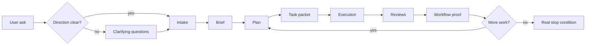

# 🧠 devgod

<p align="center">
  <strong>manager-led workflow control layer, shared runtime, and proof system for Codex-based software work</strong>
</p>

<p align="center">
  
  
  
  
  
  
</p>

> `devgod` is an installable package that adds a reusable control layer, runtime-backed workflow state, operator tooling, and proof-oriented completion checks to Codex-driven repository work.
>
> It tries to make Codex behave less like a loose chat session and more like a small engineering org with scope, memory, review gates, and receipts.

```text
user ask
   ↓
clarify direction when needed
   ↓
intake
   ↓
brief → plan → task packet → execution → reviews → workflow proof → next task
```

## ✨ At A Glance

`opt-in overlay` `production-oriented package checks` `runtime-backed authority` `review gates` `autonomous continuation` `MCP server` `operator UI` `docs export`

For a new substantive request, DevGod now biases toward a short clarification pass before planning or implementation. The default target is up to four questions covering intended outcome, primary user or operator, constraints or non-goals, and concrete done criteria. If the request is already clear enough, DevGod should record explicit operating assumptions instead of asking unnecessary questions.

## 📦 What It Is Right Now

As of `2026-05-21`, this repo is the package source of truth for DevGod.

It ships:

- a repo installer and upgrade overlay for consuming repositories
- reusable `AGENTS.md`, `.codex/agents/`, `.agents/skills/`, `.devgod/rules/`, and `.devgod/templates/`
- a TypeScript CLI and runtime service for task state, reviews, approvals, checkpoints, reports, and workflow proof
- autonomous continuation surfaces including `status`, `coverage`, `gaps`, `loop`, `daemon`, `supervisor`, `recover`, and `plan-context`
- a modernization-grade autonomous profile, `modernization_program`, with stricter rewrite readiness gates
- installed-repo verification harnesses and a supported `seed-modernization-proof` path
- control-layer hook hardening for authority mismatch detection and explicit successor task handoff scope
- clarification-first intake steering for new substantive requests, with runtime-visible clarifying questions and explicit assumptions
- an MCP server and lightweight operator UI

> This repo proves the package behavior.
> It does not prove that every consuming repo is fully operational after install.

Installed repos still need their own runtime registration, review identity wiring, and repo-local evidence.

This package is still an `opt-in overlay` with `production-oriented package checks`, not a blanket certification that every consuming repo is production-ready after installation.

## 🎯 Mission

Devgod is trying to make AI coding work less hand-wavy.

It pushes a session away from:

- "the model said it was done"

and toward:

- explicit scope
- tracked artifacts
- review gates
- verification evidence
- persisted runtime state
- clear next actions when work is not actually complete

The big idea is simple: autonomy is only useful if it is inspectable, resumable, and skeptical of its own claims.

## 🗺️ Workflow Map



## 🏠 The Two Places Devgod Lives

| Place | What it is | What it owns |
| --- | --- | --- |
| `this repo` | the package source of truth | reusable runtime, installer, MCP/UI, rules, templates, skills, agent profiles |
| `a consuming repo` | where real project work happens after install | `.env.devgod`, `.devgod/work/`, runtime registration, authenticated reviews, project-specific overlays |

Short version:

- this repo owns reusable package assets under `src/`, `scripts/`, `.agents/`, `.codex/`, and `.devgod/templates/`
- consuming repos own their own local workflow state and runtime setup

Keep that boundary straight. Package verification here is evidence about the package. It is not blanket proof for target repos.

## 📍 Current State Summary

The most important package-level milestones now shipped in this repo are:

- runtime-backed workflow authority rather than markdown-only workflow claims
- autonomous execution reporting with coverage, gap, checkpoint, and continuation surfaces
- modernization-mode evidence for cartography, invariants, duplicate families, architecture decisions, migration ledgers, and parity requirements
- installed-repo proof that a fresh target repo can reach modernization readiness without leaking package-repo runtime state
- hook-side hardening so stale `.devgod/ACTIVE` state and missing successor packet scope do not stall valid continuation
- clarification-first intake steering for new substantive requests, with runtime-visible clarifying questions and explicit assumptions

For the plain-language snapshot, see [docs/current-state.md](docs/current-state.md).

## 🧱 Current Shape

### 🛠️ Install and upgrade overlay

Shipped through:

- `src/install/cli.ts`
- `src/install/merge.ts`
- `scripts/install-devgod.sh`
- `scripts/setup-devgod.sh`

This layer installs or upgrades the managed DevGod overlay without flattening unrelated repo config.

### 🏦 Runtime and authority layer

Shipped through:

- `src/admin.ts`
- `src/core/service.ts`
- `src/store/postgres-store.ts`
- `src/runtime/`
- `src/sql/migrations/`

This layer tracks projects, runs, tasks, reviews, approvals, checkpoints, retrieval work, and runtime authority.

### 📋 Workflow and control layer

Shipped through:

- `.devgod/templates/`
- `.devgod/rules/`
- `.agents/skills/devgod-*`
- `.codex/agents/*.toml`
- `plugins/devgod/scripts/`

This layer governs intake, planning, execution expectations, review gates, write-scope enforcement, continuation, and stop conditions.

At intake, the managed control layer should ask concise direction-setting questions before planning whenever the request is substantive and still ambiguous. Trivial mechanical work can still stay on the fast path.

### 🧭 Operator and inspection layer

Shipped through:

- `src/admin/devgod.ts`
- `src/admin/status.ts`
- `src/admin/ops.ts`
- `src/admin/report.ts`
- `src/mcp/server.ts`
- `src/ui/server.ts`

This is how operators and tools inspect what the runtime currently considers true.

### 🗃️ Knowledge and export layer

Shipped through:

- `src/runtime/repo-markdown-indexer.ts`
- `src/docs-export/`
- `src/store/qdrant-artifact-index.ts`

This layer supports retrieval refresh, markdown indexing, artifact search, and Obsidian-oriented export.

## 🚀 Quick Start

### If you are working on `devgod` itself

Requirements:

- Node.js `>=22`
- `npm`
- Docker if you want the default local runtime path

Useful source-repo commands:

```bash
npm run devgod -- help
npm run install:project -- init --apply --target /absolute/path/to/project
npm run setup:local
npm run doctor
npm run status
npm run ops
```

### If you want to install `devgod` into another repo

From this source repo:

```bash
npm run install:project -- init --apply --target /absolute/path/to/project
```

Then inside the target repo:

```bash
npm install
npm run devgod:setup:git-guard
npm run devgod:verify:git-guard
npm run devgod:setup:local
npm run devgod:doctor
npm run devgod:verify:setup
```

Important:

- installed repos get the `devgod:*` script names
- this source repo uses shorter package-maintainer names like `setup:local`, `doctor`, and `status`

## 🧰 Command Surfaces

### Source repo commands

Common package-maintainer commands in this repo:

```bash
npm run devgod -- help
npm run setup:local
npm run doctor
npm run status
npm run ops
npm run devgod -- report --run-id latest
npm run devgod -- coverage --run-id latest --format text
npm run devgod -- gaps --run-id latest --format text
npm run devgod -- loop --run-id latest --format text
npm run devgod -- workflow-proof --run-id latest --task-id <task-id>
npm run devgod -- serve-ui
npm run mcp
```

Other important source-repo scripts that really exist today:

- `npm run install:project -- init --apply --target /absolute/path/to/project`
- `npm run scaffold:workflow`
- `npm run seed:happy-path-fixture`
- `npm run verify:setup`
- `npm run verify:workflow`
- `npm run verify:release-overlay`
- `npm run verify:migrations:live`
- `npm run export:docs`

### Installed repo commands

After installation, a consuming repo gets repo-local `devgod:*` scripts. Common ones are:

```bash
npm run devgod:setup:git-guard
npm run devgod:verify:git-guard
npm run devgod:setup:local
npm run devgod:doctor
npm run devgod:verify:setup
npm run devgod:status
npm run devgod:coverage
npm run devgod:gaps
npm run devgod:ops
npm run devgod:report
npm run devgod:loop
npm run devgod:supervisor
npm run devgod:seed-workflow-proof
npm run devgod:seed-modernization-proof
npm run devgod:verify:review-identity
npm run devgod:export-docs -- "summarize what we worked on today"
```

Installed repos also get:

- `devgod:checkpoint`
- `devgod:resume`
- `devgod:advance-active-task`
- `devgod:reconcile`
- `devgod:sync-runtime-exports`
- `devgod:refresh-retrieval`
- `devgod:autopilot-status`
- `devgod:mcp`
- `devgod:ui`
- `devgod:scaffold-workflow`
- `devgod:upgrade-reasoning-workflow`
- `devgod:seed-happy-path-fixture`
- `devgod:check:happy-path`
- `devgod:check-workflow`

## 💡 Why It Feels Different

Devgod is opinionated about a few things:

- the root thread should act like an engineering manager, not a solo autocomplete
- substantive work should leave artifacts behind
- review gates should exist even when one human is driving the session
- runtime state should outrank chat confidence
- "continue until complete" should mean bounded repair loops and explicit blockers, not infinite retries

## 🚧 Current Boundaries

Important boundaries that still apply:

- consuming repos still need their own runtime setup, review identity backend, and authenticated workflow proof
- runtime rows remain the authority boundary over markdown exports
- the package can ship modernization-mode logic and proofs, but rewrite readiness in a target repo still depends on that repo's own evidence
- redesign docs describe the operating model and roadmap, not a guarantee that every installed repo already satisfies it

## 🛡️ Release Posture

Devgod still ships a careful `repo-local release posture`.

Use the package checks here as evidence about the package itself:

- `npm run verify:release-overlay`
- `npm run verify:migrations:live`

Do not treat those checks alone as `any claim that a consuming repo is fit for production use`.
That still depends on the target repo, its runtime wiring, its review identity setup, and its own operational decisions.

## 📚 Docs Map

- [docs/current-state.md](docs/current-state.md): plain-language snapshot of what DevGod is today
- [docs/global-setup.md](docs/global-setup.md): source repo versus consuming repo setup notes
- [docs/large-repo-modernization-mode.md](docs/large-repo-modernization-mode.md): modernization-mode design and shipped rollout status
- [docs/autonomous-execution-redesign.md](docs/autonomous-execution-redesign.md): broader redesign contract and architecture direction
- [docs/devgod-goal-gap-audit.md](docs/devgod-goal-gap-audit.md): historical gap audit context
- [docs/benchmarks/orchestration-benchmark.md](docs/benchmarks/orchestration-benchmark.md): orchestration benchmark notes

## 🗂️ Repo Layout

```text
src/         runtime, installer, MCP, UI, exports, store
scripts/     setup, install, verification, workflow checks
.agents/     devgod skills
.codex/      devgod agent profiles and config
.devgod/     rules, templates, memory docs, package-maintainer workflow state
docs/        current state, setup notes, redesign, modernization, benchmarks
tests/       package verification and regression coverage
plugins/     packaged hook/plugin surfaces
```

## 🧪 Honest Pitch

Devgod is trying to turn:

`AI coding assistant`

into:

`small engineering org with runtime state, process, and receipts`

Right now the honest description is:

- reusable package
- workflow controller
- runtime-backed evidence system
- Codex overlay for repository work

Not magic. Just stricter operating rules and better proof for model-driven work.
